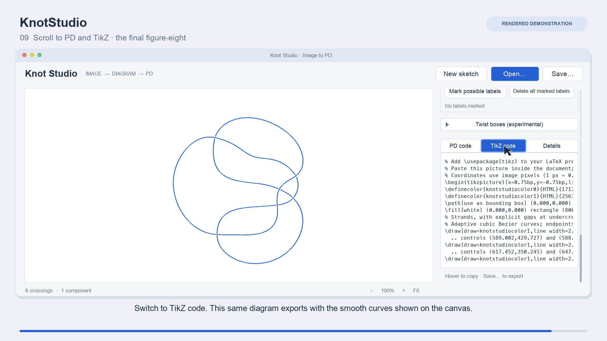

# Knot Studio

Knot Studio is a desktop app that helps you turn pictures of knots and links into
diagrams you can edit. Start with a photo, a screenshot, or your own drawing,
then move strands and modify the diagram. Save the result as an image, PD code,
or export it for LaTeX.

## Demo

[Watch the demo](demo/KnotStudio-demo.mp4) (2 min 48 sec): image recognition,
drawing, Reidemeister moves, simplification, energy minimization, and PD/TikZ export.
This demonstration recreates the interface using actual program results;
timings have been shortened.
See [demo notes](demo/README.md), [chapters](demo/KnotStudio-demo-chapters.md),
and [captions](demo/KnotStudio-demo.srt).

## Install and use

Choose the download for your computer from [Releases](https://github.com/32805433/KnotStudio/releases).
If a platform is absent, a packaged release for it is not available yet.

| Computer | Package | Requirements |
| --- | --- | --- |
| Mac | macOS ARM64 ZIP | Apple silicon (M1 or later), macOS 15.7.5 or later |
| Windows | Windows x86-64 installer | Windows 11; the same package targets Windows 10 22H2 compatibility |
| Linux | Linux x86-64 archive | Ubuntu 24.04 LTS or later, with an X11 or XWayland desktop |

1. Install or extract the package following the [installation guide](docs/INSTALLING.md).
2. Open Knot Studio and choose **Open…** to load your picture.
3. If labels or twist boxes are marked, review them, delete unwanted labels, and choose **Recognize drawing**. Otherwise, recognition starts automatically.
4. Check the reconstructed crossings and components before using the result.

Recognition runs locally and works offline. The packages include Python and OCR.
Intel Mac and Windows/Linux ARM packages are not provided.

> **macOS warning:** The default build is not notarized by Apple. If macOS says it
> cannot check Knot Studio or verify its developer, see the
> [first-launch instructions](docs/INSTALLING.md#if-macos-blocks-opening-the-app).

## What it does

- Recognizes knot and link diagrams from screenshots, iPad drawings, and
  photographs of whiteboards and blackboards.
- Supports sketching, erasing, crossing changes, reversing component
  orientations, Reidemeister moves, and diagram smoothing.
- Recognizes and edits numbered twist boxes with integer or half-integer values.
  This is currently experimental.
- Saves diagrams for later editing and exports images, PD code, and LaTeX drawings.

## User guides

| Guide | Contents |
| --- | --- |
| [Installation](docs/INSTALLING.md) | Download, install, and first-launch help |
| [User guide](docs/USER_GUIDE.md) | Open, recognize, draw, edit, save, and export |
| [Examples](docs/EXAMPLES.md) | Example pictures and their sources |
| [Twist boxes](docs/TWIST_BOXES.md) | Recognize, add, combine, and expand twist boxes |
| [Diagram smoothing](docs/ENERGY.md) | Smooth a selected region or the whole diagram |
| [Developer guide](docs/DEVELOPING.md) | Run from source, test, and build releases |

## Acknowledgments

Knot Studio was written by **Codex using GPT-6 Astra**, under the project
author's direction and review.

Knot Studio's main image-recognition and drawing features are based on
[KnotFolio](https://github.com/kmill/knotfolio), created by Kyle Miller.
Its energy minimizer is based on the diagram-layout method in
[KnotJob](https://www.maths.dur.ac.uk/users/dirk.schuetz/knotjob.html),
created by Dirk Schütz. See the [third-party notices](docs/THIRD_PARTY.md)
for implementation details and licensing.

## License

Knot Studio is distributed under [GNU GPL version 3 or later](LICENSE), with no
warranty. Third-party software and example images retain their respective terms. See
[third-party notices](docs/THIRD_PARTY.md) and [example provenance](docs/EXAMPLES.md).
