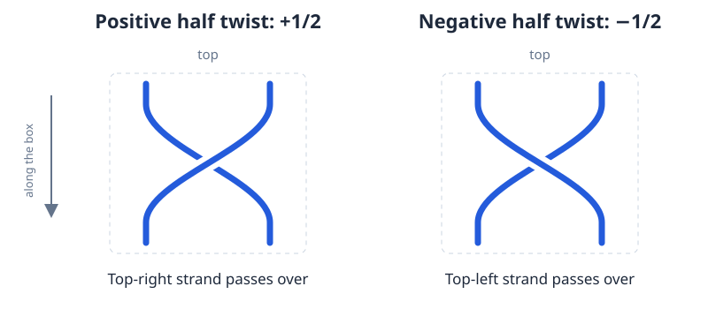

# Twist boxes

Twist boxes let you show several twists with a labeled rectangle instead of
drawing every crossing. This feature is currently experimental.

## What the number means

The number counts **full twists of the whole bundle**. A bundle can contain two,
three, or more strands. `1/2` means one positive half twist of the whole bundle;
`-1/2` means its inverse. In a half twist every pair of strands crosses once.
With more than two strands, the twist still involves the entire bundle.

| Number | Two strands | Three strands |
| --- | ---: | ---: |
| `0` | No crossings | No crossings |
| `1/2` | 1 crossing | 3 crossings |
| `1` | 2 crossings | 6 crossings |
| `-3/2` | 3 crossings, negative twists | 9 crossings, negative twists |

An odd number of half twists reverses the order of the strands between the two
ends. A whole number of full twists preserves that order. Changing the number
can change both the link type and the number of components.

### Positive and negative twists

For the illustration below, look at the box with its bundle running **from top
to bottom on the page**. A positive elementary crossing has the top-right
strand passing over the top-left strand; a negative crossing reverses that
choice. The downward arrow shows how to view the box, not a required component
orientation. Rotate a tilted box mentally into this position.

Different papers can use different signs for a printed box. Knot Studio reads
the printed number and uses the convention above; it does not determine the
author's convention. Check that convention before relying on the PD code.
Imported box diagrams therefore remain **Needs review**.

## Import and review

1. Choose **Open…** and select a picture. If possible labels or boxes are found,
   the app waits for review. Ordinary labels appear in amber; boxes appear in
   blue or orange. With no markings, recognition starts automatically.
2. Review and delete unrelated amber labels first. Shift-click any marking on
   ink you want to keep before using **Delete all marked labels**.
3. Click **Twist boxes (experimental)** to expand its controls. If a box was
   missed, choose **Mark a missed twist box…**, drag a rectangle around its
   entire border, and enter the number.
4. Choose **Review twist boxes**, then click each box to check or correct its
   number. Enter an integer or half-integer such as `1`, `-2`, `1/2`, or `-3/2`.
   An orange **?** means a value is needed; it is never treated as zero.
5. Choose **Recognize drawing**, then check the entering strands, connections,
   crossings, components, and orientations against the picture.

If several boxes show **?**, **Fill missing twist values…** visits each one and
starts recognition after all values are entered. Finish reviewing labels and
marking missed boxes before using this shortcut. Cancel keeps completed entries
and leaves the remaining values unknown.

To discard an incorrect box marking, click it, cancel the value dialog, then
choose **Unmark selected box**. This removes the marking without erasing any of
the picture. You can then mark a clearer rectangle. These marking controls are
available only in drawing mode.

Boxes protect their numbers from **Delete all marked labels**. Ordinary label
review does not read text; number recognition applies only inside twist boxes.
Review edits can be undone and do not overwrite the original picture. After
pencil or eraser edits, scan for markings again.

A box may still fail recognition even after its number is supplied, because
its strand connections are unclear. Try a clearer marking or repair the picture.
Frames with missing sides, touching text, tiny handwriting, or unrelated strands
across the borders are difficult cases. A failure does not mean the source
diagram is invalid. Symbolic numbers such as `n` or `2k+1` are not supported.

## Select, change, and resize a box

Open the **Twist boxes (experimental)** panel in diagram mode. Choose
**Select / move**, click a box, then choose **Edit selected twist value…** to
change its number. **Undo** restores the previous value.

To resize, point at an edge until it highlights and the cursor becomes a double
arrow. Click, hold, and slide perpendicular to the edge. The opposite edge stays
fixed; nearby strands follow. **Move radius** controls how far the surrounding
movement extends. Release keeps the accepted change; **Escape** cancels the
gesture.

Crossings, orientations, and twist numbers are preserved while resizing. A box
cannot collapse to zero width or deform another box. A rejected position leaves
the last accepted size visible. The box number rotates with its attachment
edges. Its baseline follows the lower attachment edge, or the right-hand edge
if both are at the same height.

The app automatically aligns strands on the two attachment edges when a diagram
is opened or recognized and when boxes are edited. If passing strands or
crowded geometry prevent safe alignment, the box keeps its existing layout.

## Move strands and smooth the diagram

In **Select / move**, drag an external strand across a box normally to pass
**over** it. Hold **Shift while creating the passage** to pass **under** it.
Above-box strands remain visible; below-box strands are hidden by the box.
Existing over/under choices remain unchanged. **Undo** restores the whole drag.

**Minimize energy…** smooths strands outside boxes. The boxes, their attachments,
and strands inside them stay fixed; nearby strands are encouraged to meet box
edges at right angles. See [Diagram smoothing](ENERGY.md).

**Add curl…** and **Simplify** also work outside boxes. A shaded curl or bigon
cannot contain a box, even a `0` box. Expand a box first to edit individual
crossings inside it. Component deletion, dragging the whole box freely, and
moving individual attachment points are not currently available with boxes.

## Add twists

1. Choose **Add twists…**.
2. Draw a straight cutting segment across the parallel strands you want to
   twist. Extend both ends into empty space beyond the outer strands. Avoid
   crossings and boxes, and leave room for a small rectangle around the cut.
3. Release and enter an integer or half-integer number of full twists.

The strands do not need to be perfectly straight, but the cut must cross them
clearly and they must run roughly parallel near it. The rectangle must not
include unrelated strands. If there is insufficient room, the edit is rejected.

Adding twists generally changes the link. A half twist can join components; if
their previous directions become incompatible, the app assigns a consistent
direction and reports the change.

## Combine boxes or remove a zero box

Choose **Combine adjacent boxes…**, then click two boxes on the same directly
connected bundle. They must contain the same number of strands, with no extra
strand, crossing, or box between them. The result has the sum of their numbers.

The connecting strands can bend, but the program must be able to follow them
consistently through both boxes. Sharp turns or separate strands passing
through a box may prevent combining. Try moving nearby strands out of the way,
or expand the boxes and work with their individual crossings.

A sum of zero remains visible as a `0` box. Select it in **Select / move**, then
choose **Delete selected zero box** to join its untwisted strands. A nonzero box
must be expanded to remove its rectangle while keeping its twists.

## Expand all or part of a box

1. In **Select / move**, select a box and choose **Expand selected box…**.
2. Enter **all**, or a nonzero amount with the same sign and no larger magnitude
   than the box number. Expanding `-1` from `-2`, for example, draws one negative
   full twist and leaves a `-1` box.
3. The app marks the box ends **A** and **B**. Click **Side A** or **Side B** to
   place the expanded twists at that end. For a full expansion, **Both sides**
   keeps the result centered and makes room equally at both ends.

Expansion first uses the rectangle's interior. If more space is needed, the
chosen end must have a clear, roughly straight continuation of the same bundle.
Nearby crossings, boxes, or insufficient strand spacing can prevent expansion.
Only the selected box expands; other boxes stay unchanged.

A box with separate strands passing over or under it can currently be expanded
only in full. A partial expansion is not supported for such a box. **Cancel**
leaves it unchanged.

## Turn a drawn twist region into a box

Choose **Box selected tangle…**, then circle the desired region. The boundary
should cross each entering or leaving strand once, avoid crossings, and leave
an empty margin around the twists. The program looks for two ordered groups of
strands at opposite ends and checks that the region is a whole-bundle twist.

Different drawings of the same twist can qualify, including bent strands and
extra pairs of crossings that cancel. The check does not accept every possible
drawing. Internal closed components, nested boxes, self-crossings, unclear
contacts, or too little space around the boundary can prevent conversion.
Try a larger selection or straighten the bundle. A rejection does not prove the
tangle is mathematically different from a twist.

## Undo, saving, and PD output

Each successful box operation is one undoable edit. **Escape** cancels pending
work. If an edit is rejected, the current diagram stays unchanged.

Choose **Save… → Editable diagram JSON** to preserve boxes and their connections
for later editing. PNG, SVG, and TikZ keep the visible box notation. **Convert
to drawing** creates a picture of that notation, so the boxes must be recognized
and reviewed again.

Plain PD cannot contain boxes, so PD output expands them into ordinary
crossings. The default limit is 10,000 crossings, including separate passages.
A box can exceed that limit while remaining compact and editable; save JSON
when the PD preview is too large.

For data fields, Python operations, and the recognition algorithm, see the
[technical reference](TWIST_BOXES_TECHNICAL.md).
